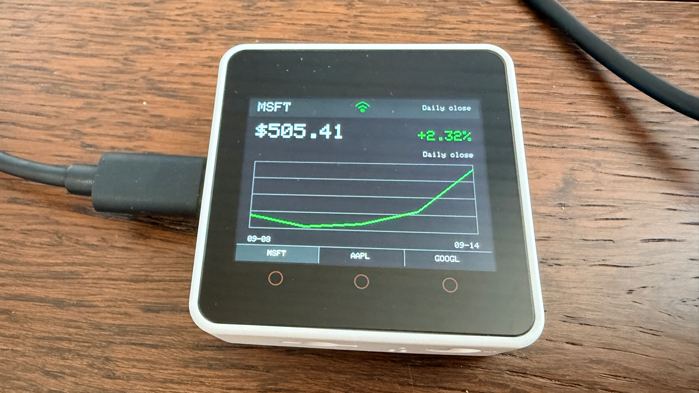

## Features

* Maps the three Core2 buttons to configurable stock symbols
* Cycles the selected symbol through daily, weekly, and monthly charts
* Displays the selected symbol's latest available close and chart-period change
* Shows Wi-Fi connection state in the top-center header icon
* Shows battery percentage, low-battery state, and charging state in the top bar
* Draws green, red, or gray graph for rising, falling, or flat prices
* Loads Wi-Fi, API, and symbol settings from the microSD card at startup
* Uses hourly Alpha Vantage data for daily and weekly premium charts
* Uses daily closes for monthly charts and keys without intraday entitlement
* Keeps last valid graph visible when Wi-Fi or API requests fail
* Runs HTTPS requests on a background FreeRTOS task to keep display loop responsive

## Prerequisites

* PlatformIO
* M5Stack Core2 connected over USB for upload and device tests
* FAT-formatted microSD card
* Alpha Vantage API key; premium access enables hourly data

## Configuration

Copy [settings.ini.default](settings.ini.default) to a file named `settings.ini`
in the root of a FAT-formatted microSD card, then replace placeholder values:

```ini
[wifi]
ssid = your-wifi-name
password = your-wifi-password

[market]
api_key = your-alpha-vantage-api-key
symbol_a = MSFT
symbol_b = AAPL
symbol_c = GOOGL
refresh_minutes = 30
```

`symbol_a`, `symbol_b`, and `symbol_c` map from left to right across the three
Core2 buttons. Symbols are converted to uppercase and may contain up to 12
letters, numbers, dots, or hyphens.

The settings file must be no larger than 2 KiB. Insert the card before powering
on or resetting Core2. Firmware validates required values before starting Wi-Fi
or market-data tasks. It shows `SD card missing` when no card can be mounted,
`settings.ini missing` when the root file is absent, and a specific validation
error when contents are invalid.

Credentials remain on the removable card instead of being compiled into
firmware. Protect the card because anyone with physical access can read them.

## Build And Upload

```bash
pio run -e m5stack-core2
pio run -e m5stack-core2 --target upload
pio device monitor --baud 115200
```

Startup shows the first configured symbol's daily chart. Press its button once
to show the weekly chart, again to show the monthly chart, and again to return
to the daily chart. Further presses repeat the cycle. Pressing a different
symbol starts that symbol at its daily chart.

Daily and weekly charts use hourly prices when the API key has intraday access.
Monthly charts use the latest 22 daily closes. When intraday access is
unavailable, the daily chart uses the latest two closes and the weekly chart
uses the latest five closes. The period name appears above the graph.

Normal refreshes follow `refresh_minutes`. Daily data uses at least 65 minutes
to remain below Alpha Vantage's 25-request daily quota. Each period or symbol
change triggers a fetch and counts toward that quota. Exhausted quotas show
`API daily limit` and retry after at least 65 minutes. Other failed requests
retry after one minute.

The top bar shows current battery percentage beside a battery icon. Battery fill
turns red at 20 percent or below. A yellow lightning symbol appears while the
battery is charging. Battery state refreshes every 10 seconds. Daily fallback
charts use close-to-close movement because current-day intraday prices are not
available.

## Validation

Compile firmware and embedded tests without hardware:

```bash
pio run -e m5stack-core2
pio test -e m5stack-core2 --without-uploading --without-testing
pio check -e m5stack-core2 --skip-packages
```

Run tests on a connected Core2:

```bash
pio test -e m5stack-core2
```

Device testing must confirm all three button mappings, daily-weekly-monthly
cycling, Wi-Fi connection, battery level and charging state, NTP
synchronization, HTTPS trust, Alpha Vantage entitlement, graph rendering, and
recovery after network loss.

## Publish To GitHub

Initialize the local repository if this directory is not already a Git
repository:

```bash
git init
```

Before publishing, confirm Git ignores any local credentials copy:

```bash
git check-ignore settings.ini
```

The command must print `settings.ini`. Never commit credentials copied from the
SD card or files from the `.pio` build directory. Create the first commit:

```bash
git add .
git commit -m "Initial MS Stock display"
```

Authenticate GitHub CLI, then create and push a public repository:

```bash
gh auth login
gh repo create ms-stock-core2 --public --source=. --remote=origin --push
```

Replace `--public` with `--private` when source code should not be public.

## License

Licensed under the [MIT License](LICENSE).
